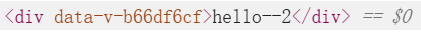
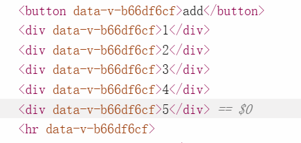
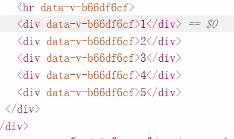

# vue面试题中常见的关于原理的实现demo

每个demo在一个页面中，新建demo只需要在新建页面（定义路由、写页面即可）

## 谷歌浏览器调试工具
元素选项卡中如果只是对于元素标签闪烁改变说明是dom节点重建了

如果是元素标签以及内部文本内容闪烁改变说明是vue的diff算法进行patch复用

## 列表中key的哲学

**使用index作为key**

虚拟dom下面使用key(真实值)（如0(1)、1(2)）区分，当点击add时会在列表最开始添加0，从12345变为012345

旧：0(1)	1(2)	2(3)	3(4)	4(5)

新:   0(0)        1(1)	2(2)	3(3)	4(4)	5(5)

先旧头新头相比，发现一样进行复用，使用新的0上的属性更新旧的0，导致真实dom上的值从1变为了0

然后旧新虚拟dom指针后移到1同理，直到旧指针到4，此时结束遍历，总共修改了5次

最后根据新虚拟dom指针指向的5创建一个新的真实dom，创建了1次

上述修改总共操作了6次

**使用唯一值作为key**

虚拟dom下面使用key(真实值)（如0(1)、1(2)）区分，当点击add时会在列表最开始添加0，从12345变为012345

旧：1(1)	2(2)	3(3)	4(4)	5(5)

新:   0(0)        1(1)	2(2)	3(3)	4(4)	5(5)

先旧头新头相比，发现不一样；在对比旧尾新尾，发现一样进行复用，旧新虚拟dom5上值都是一样的，无需更新

然后旧新虚拟dom指针前移到4同理，直到旧指针到1，此时结束遍历，复用了5次，没有做任何修改

最后根据新虚拟dom指针指向的0创建一个新的真实dom，创建了1次

上述修改总共操作了1次

